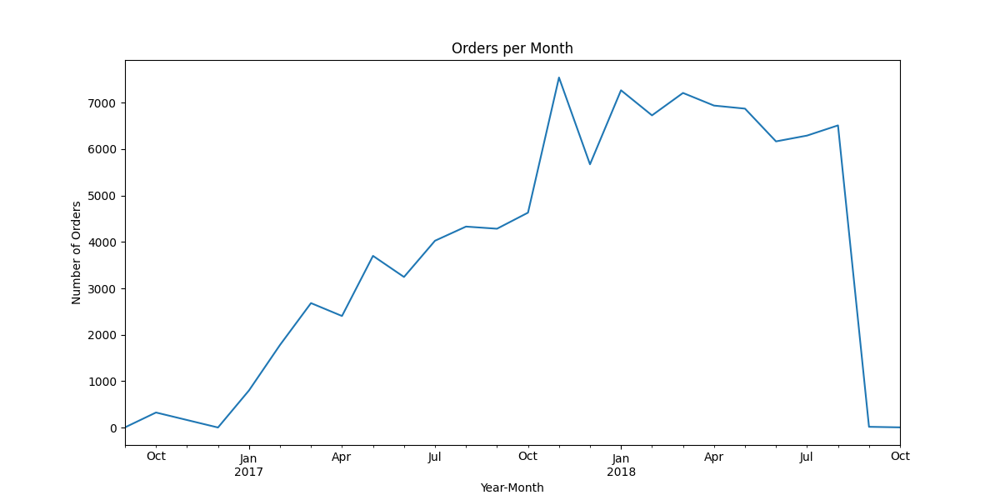
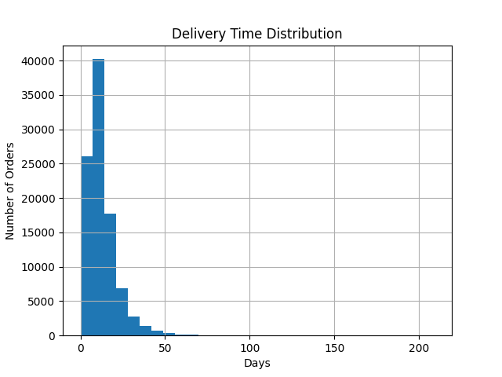
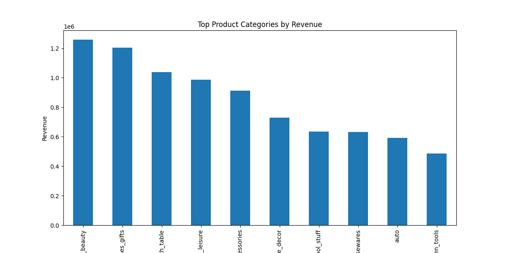

# 📊 E-commerce Sales Analysis

## Project Overview

This project analyzes sales data from a Brazilian e-commerce platform in order to extract business insights about orders, delivery performance, and product category revenue.

The goal of this analysis is to demonstrate data analysis skills using Python and real-world datasets.

---

## 🛠 Tools Used

* Python
* Pandas
* Matplotlib
* Seaborn
* Jupyter Notebook

---

## 📂 Dataset

The dataset used in this project is the **Olist E-commerce Dataset** from Kaggle.

It contains information about:

* Orders
* Customers
* Products
* Payments
* Delivery dates
* Product categories

---## Business Questions

This analysis aims to answer the following business questions:

* How has the number of orders changed over time?
* What is the distribution of delivery times?
* Which product categories generate the highest revenue?
* Are there patterns that could help improve logistics performance?
* Which product segments contribute the most to the platform’s sales?

These questions help transform raw data into actionable business insights.


## 📊 Key Analyses

### 📈 Orders Growth Over Time

This chart shows how the number of orders evolved over time.



---

### 🚚 Delivery Time Distribution

This analysis shows how long deliveries take on average.



---

### 💰 Top Product Categories by Revenue

This chart highlights which product categories generate the most revenue.



---

## 💡 Business Insights

From this analysis we can observe:

* Order volume increased over time, indicating platform growth.
* Most deliveries occur within a consistent time range.
* A small number of product categories generate a large portion of revenue.

These insights could help businesses optimize logistics and focus on high-performing product categories.

---

## 📁 Project Structure

```
ecommerce-sales-analysis
│
├── data
│   └── raw
│
├── images
│   ├── orders_per_month.png
│   ├── delivery_time_distribution.png
│   └── top_categories.png
│
├── notebooks
│   └── analise_vendas.ipynb
│
├── requirements.txt
└── README.md
```

---

## Author

Data Analysis project developed for portfolio purposes.
